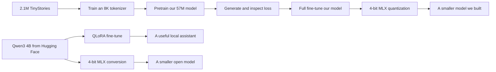
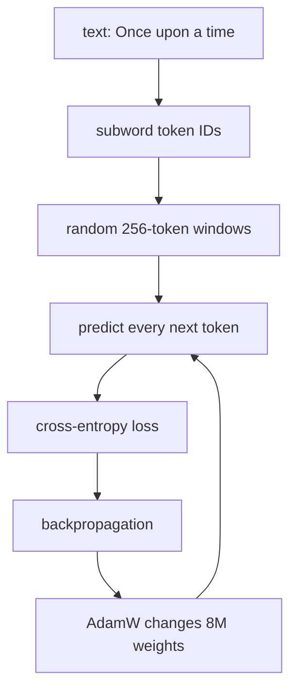

# Mac LLM Lab

Build, fine-tune, and shrink language models on one Apple-silicon Mac. The code is small enough to read, the commands are real, and every stage leaves something you can inspect.

## Open the visual course

The interactive course is plain HTML, CSS, and JavaScript: no framework, package install, or build step. Serve it from the repository root so each chapter can display the exact current Python source beside its explanation.

```bash
python3 -m http.server 8000
open http://localhost:8000/site/
```

Start with the vocabulary introduction, then follow the chapter sequence. Pretraining is split into data, transformer, and optimization chapters; fine-tuning, quantization, generation, and the complete command map each have their own page. The implementation stays deliberately small: the complete modern model is about 100 lines in [`src/macllm/model.py`](src/macllm/model.py), and every Python file under `src/macllm/` and `tests/` appears in the course with reading notes.

This course is tuned for the **M5 Pro with 48 GB unified memory** in this repository's development machine. It uses [Apple MLX](https://ml-explore.github.io/mlx/) because MLX runs directly on Apple silicon and lets the CPU and GPU share memory without copies.

> **Honest goal:** the from-scratch model becomes a good small story model, not a general assistant. A laptop cannot reproduce frontier pretraining. The default `standard` run is the strongest useful learning project here: about **57M parameters** and **82M training tokens** in a few hours. Exact time depends on thermals and MLX versions, so the first report gives your measured tokens/second.

## The whole course on one screen



## Choose the size of the experiment

| Preset | Model | Tokens seen | Purpose | Rough M5 Pro time* |
|---|---:|---:|---|---:|
| `quick` | ~8M params | 6M | Prove the whole pipeline | 10–30 min |
| `standard` | ~57M params | 82M | Recommended balance | 3–8 h |
| `overnight` | ~113M params | 205M | Better output, slower iteration | 12–30 h |

\*Planning ranges, not benchmarks. After the first evaluation, estimate your run with `remaining tokens ÷ reported tok/s`. Closing the lid pauses useful work; keep the Mac powered and awake.

The model is intentionally modern rather than a copy of GPT-2: causal grouped-query attention, rotary positions, RMS normalization, SwiGLU feed-forwards, and tied input/output embeddings. Read [the architecture picture](docs/concepts.md) before the code in [`src/macllm/model.py`](src/macllm/model.py).

## 0 · Set up once

Python 3.11–3.13 is supported.

```bash
python3 -m venv .venv
source .venv/bin/activate
python -m pip install --upgrade pip
python -m pip install -e '.[dev]'
macllm doctor
```

All model computation stays on this Mac. Dataset and model downloads come from Hugging Face; no prompts or training examples are uploaded by these commands.

## 1 · Pretrain our model

Start with the quick run even if you intend to use `standard`.

```bash
macllm prepare --preset quick
macllm inspect --data data/prepared/quick --text "Once upon a little time"
macllm train --preset quick
macllm generate --checkpoint runs/quick --prompt "Once upon a time" --max-new-tokens 160
macllm dashboard --run runs/quick
open runs/quick/dashboard.html
```

What just happened:



When that works, make the recommended model:

```bash
macllm prepare --preset standard
macllm train --preset standard
macllm generate --checkpoint runs/standard --prompt "Once upon a time" --max-new-tokens 240
macllm dashboard --run runs/standard
open runs/standard/dashboard.html
```

Checkpoints are written at every evaluation and on `Ctrl-C`, so an intentional stop does not lose the latest weights. Continue with the visual walkthrough in [Part 1: pretraining](docs/01-pretrain.md).

## 2 · Fine-tune two models

### 2A · Our model: full fine-tuning

Our model is small enough to update every weight. The included examples teach a compact story style; replace them with your own `prompt`/`completion` JSONL when ready.

```bash
macllm finetune \
  --checkpoint runs/standard \
  --data data/our-model/train.jsonl \
  --output runs/standard-story-tuned \
  --steps 300

macllm generate \
  --checkpoint runs/standard-story-tuned \
  --prompt $'Write a tiny story about a patient robot.\nStory:' \
  --max-new-tokens 180
```

### 2B · Hugging Face model: QLoRA

[Qwen3-4B](https://huggingface.co/Qwen/Qwen3-4B) is a capable Apache-2.0 text model. We fine-tune the [MLX Community 4-bit conversion](https://huggingface.co/mlx-community/Qwen3-4B-4bit), so only small LoRA adapter matrices learn. The first command downloads about 2.3 GB.

```bash
mlx_lm.lora \
  --model mlx-community/Qwen3-4B-4bit \
  --train \
  --data data/qwen \
  --mask-prompt \
  --iters 300 \
  --batch-size 1 \
  --num-layers 8 \
  --max-seq-length 1024 \
  --grad-checkpoint \
  --adapter-path runs/qwen3-4b-adapter

mlx_lm.chat \
  --model mlx-community/Qwen3-4B-4bit \
  --adapter-path runs/qwen3-4b-adapter
```

Read [Part 2: fine-tuning](docs/02-finetune.md) for the masking picture, the LoRA intuition, data format, and before/after test.

## 3 · Quantize weights

Quantization stores groups of weights with small integers plus a scale. It reduces model size; it does **not** make training better, and 4-bit output may differ slightly.

### Our model

```bash
macllm quantize \
  --checkpoint runs/standard-story-tuned \
  --output runs/standard-story-tuned-4bit \
  --bits 4

macllm generate \
  --checkpoint runs/standard-story-tuned-4bit \
  --prompt $'Write a tiny story about a patient robot.\nStory:' \
  --temperature 0
```

### A Hugging Face model, from original weights

This deliberately starts from the official 8 GB Qwen weights so you perform the conversion yourself. Expect roughly 11 GB of disk use while both the Hugging Face cache and 4-bit output exist.

```bash
mlx_lm.convert \
  --model Qwen/Qwen3-4B \
  --mlx-path runs/qwen3-4b-4bit \
  --quantize \
  --q-bits 4 \
  --q-group-size 64

mlx_lm.chat --model runs/qwen3-4b-4bit
```

See [Part 3: quantization](docs/03-quantize.md) for a fair comparison protocol and the important difference between MLX 4-bit and GGUF formats.

## Repository map

```text
data/                    tiny teaching fine-tune datasets
docs/                    the three-part visual tutorial
site/                    interactive course; no build step
src/macllm/model.py      readable Llama-style model
src/macllm/data.py       streaming data + BPE tokenizer
src/macllm/training.py   pretraining loop + metrics
src/macllm/finetune.py   full fine-tuning with prompt masking
src/macllm/quantization.py 4-bit conversion for our model
tests/                   fast correctness checks
```

## Guardrails

- Keep at least 15 GB of disk free for `standard`; Qwen conversion needs more.
- Run one memory-heavy ML task at a time. Unified memory is shared with macOS.
- Training output is under ignored `runs/`; prepared tokens are under ignored `data/prepared/`.
- TinyStories is synthetic, English, and narrow. Its dataset card lists the CDLA-Sharing-1.0 license. Do not mistake low story loss for broad language ability.
- Read model and dataset cards before redistributing derived weights.

If something fails, use [troubleshooting](docs/troubleshooting.md), then run `macllm doctor` and include its output with the error.
