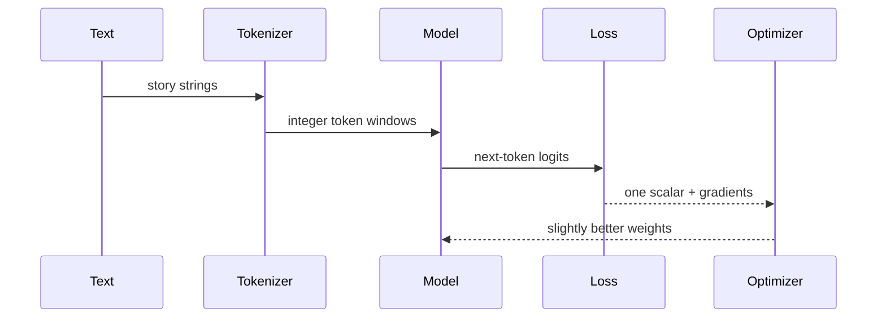

# Part 1 · Pretrain from random weights

## What you are building

The weights begin as random numbers. The tokenizer is the only prior structure: it learns common byte sequences such as `the`, `ing`, and punctuation from the corpus, but it knows no meaning.



## Lab A · Prepare data

```bash
macllm prepare --preset quick
```

This streams only the requested TinyStories rows, trains a byte-level BPE tokenizer, and writes compact `uint32` token files. The raw text is removed after encoding to avoid keeping two copies.

Inspect the result:

```bash
cat data/prepared/quick/dataset.json
macllm inspect --data data/prepared/quick --text "The little blue boat moved"
```

Try your own corpus without changing code:

```bash
macllm prepare --preset quick --text /absolute/path/to/my-text.txt --output data/prepared/mine
macllm train --preset quick --data data/prepared/mine --output runs/mine
```

Use documents separated by blank lines. A narrow, clean corpus teaches more clearly than a random dump.

## Lab B · Watch learning start

First run only 20 updates:

```bash
macllm train --preset quick --steps 20 --output runs/smoke
macllm generate --checkpoint runs/smoke --prompt "Once upon" --max-new-tokens 80
```

The output should be poor. That is useful: the pipeline works, but 20 optimizer updates cannot teach language.

Now run the complete quick preset:

```bash
macllm train --preset quick
macllm generate --checkpoint runs/quick --prompt "Once upon" --max-new-tokens 160
```

## Lab C · Read the loss picture

```bash
macllm dashboard --run runs/quick
open runs/quick/dashboard.html
```

```text
loss
 high  ╲
        ╲__ training loss
        ───╲___ validation loss
 low              time →
```

- Both curves falling: the model is learning transferable patterns.
- Training falls while validation rises: it is memorizing; stop or add data.
- Both flatten high: train longer, improve data, or increase capacity.
- Sudden spikes or `nan`: lower the learning rate and check the data.

Perplexity is `exp(loss)`: an intuitive but imperfect “effective choices” count. Compare it only on the same tokenizer and validation set.

## Lab D · Run the practical model

```bash
macllm prepare --preset standard
macllm train --preset standard
```

The first report arrives after MLX compiles the training graph and completes evaluation. Use its actual throughput:

```text
estimated seconds left = (steps left × batch × context) / tokens per second
```

At the end, keep three generations with fixed prompts and seeds. They are easier to learn from than loss alone:

```bash
macllm generate --checkpoint runs/standard --prompt "Once upon a time" --seed 1
macllm generate --checkpoint runs/standard --prompt "Lily found a strange box" --seed 2
macllm generate --checkpoint runs/standard --prompt "The small robot was afraid" --seed 3
```

## Read the implementation in this order

1. `TokenDataset.batch` in `src/macllm/data.py`: input/target shifting.
2. `Attention` in `src/macllm/model.py`: shapes, RoPE, and the causal mask.
3. `TransformerBlock`: two residual updates.
4. `language_model_loss` in `src/macllm/training.py`.
5. The training loop: batch → gradients → clip → AdamW → checkpoint.
