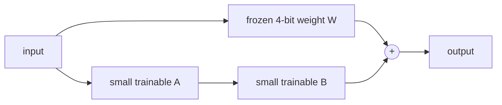

# Part 2 · Fine-tune two models

Pretraining asks “what token comes next?” across a broad corpus. Fine-tuning asks the same mathematical question on a small, carefully shaped dataset. The data changes the behavior.

## 2A · Our model: update every weight

Each line in `data/our-model/train.jsonl` has this shape:

```json
{"prompt":"Write a tiny story about a careful fox.\nStory:","completion":" Finn the fox ..."}
```

The fine-tuner hides prompt loss:

```text
tokens       Write a story ... Story:  Finn  was  ...  <eos>
loss mask       · · · · · · · · ·       ●    ●   ●      ●
```

The prompt is context, not an answer to memorize. Only completion tokens move the weights.

Before training, save a baseline:

```bash
macllm generate \
  --checkpoint runs/standard \
  --prompt "Write a tiny story about a careful fox.\nStory:" \
  --temperature 0
```

Then train and repeat the exact prompt with exact greedy decoding:

```bash
macllm finetune \
  --checkpoint runs/standard \
  --data data/our-model/train.jsonl \
  --output runs/standard-story-tuned \
  --steps 300

macllm generate \
  --checkpoint runs/standard-story-tuned \
  --prompt "Write a tiny story about a careful fox.\nStory:" \
  --temperature 0
```

Full fine-tuning is simple and appropriate for 57M parameters. It can also overwrite general abilities. Mix some original-domain examples into larger custom datasets when retention matters.

## 2B · Qwen3-4B: train small adapters

Updating all 4 billion Qwen weights would require much more optimizer memory. QLoRA keeps its 4-bit base frozen and learns low-rank adapter matrices.



The dataset at `data/qwen/` uses MLX-LM's chat format. Keep `train.jsonl`, `valid.jsonl`, and `test.jsonl` separate. A validation example must not appear in training.

Baseline chat:

```bash
mlx_lm.chat --model mlx-community/Qwen3-4B-4bit
```

Fine-tune:

```bash
mlx_lm.lora \
  --model mlx-community/Qwen3-4B-4bit \
  --train \
  --data data/qwen \
  --mask-prompt \
  --iters 300 \
  --batch-size 1 \
  --num-layers 8 \
  --max-seq-length 1024 \
  --grad-checkpoint \
  --adapter-path runs/qwen3-4b-adapter
```

Test with the adapter:

```bash
mlx_lm.chat \
  --model mlx-community/Qwen3-4B-4bit \
  --adapter-path runs/qwen3-4b-adapter
```

Ask the held-out questions from `data/qwen/test.jsonl`, plus unrelated questions. A useful adapter improves the target style without turning every answer into the same memorized paragraph.

## What to change next

- Start with 50–200 excellent examples, not thousands of noisy ones.
- Make completions look exactly like the output you want.
- Include difficult and negative examples.
- Hold out 10–20% for validation and write five human test prompts before training.
- Change one variable per run: data, iterations, rank, or learning rate.

The MLX-LM command follows its official [LoRA and QLoRA guide](https://github.com/ml-explore/mlx-lm/blob/main/mlx_lm/LORA.md).
