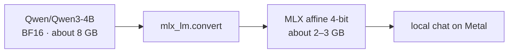

# Part 3 · Quantize without fooling yourself

## The idea

Floating-point weights store many possible values. Four-bit affine quantization groups nearby weights and stores each as one of 16 integer levels, plus group scale information.

```text
before (16-bit)   -0.137  -0.121  +0.044  +0.208
                         │ group scale
after  (4-bit)       3       4       9      15
```

The size will not be exactly one quarter because scales, metadata, the tokenizer, and some non-quantized values remain.

## Lab A · Our checkpoint

```bash
macllm quantize \
  --checkpoint runs/standard-story-tuned \
  --output runs/standard-story-tuned-4bit \
  --bits 4
```

Use greedy decoding to make a fair before/after comparison:

```bash
macllm generate --checkpoint runs/standard-story-tuned --prompt "Once upon" --temperature 0
macllm generate --checkpoint runs/standard-story-tuned-4bit --prompt "Once upon" --temperature 0
```

Compare disk size, output, and speed. Quantization mainly reduces weight memory and disk size; a tiny model may not become faster because fixed overhead dominates.

## Lab B · A Hugging Face checkpoint



```bash
mlx_lm.convert \
  --model Qwen/Qwen3-4B \
  --mlx-path runs/qwen3-4b-4bit \
  --quantize \
  --q-bits 4 \
  --q-group-size 64

mlx_lm.chat --model runs/qwen3-4b-4bit
```

MLX uses a Metal-friendly quantized representation. GGUF is a different container and quantization ecosystem commonly used by llama.cpp. “4-bit” does not mean two files from different ecosystems are interchangeable.

## A fair test sheet

Run the same 10 prompts with the same generation settings before and after. Score:

| Measure | What to record |
|---|---|
| Size | Directory MB on disk |
| Memory | Peak unified memory |
| Speed | Tokens/second after warm-up |
| Quality | Correctness and instruction-following on the 10 prompts |

Do not compare two random samples and call the difference quantization damage. Sampling randomness is larger than many 4-bit effects.

MLX documents its in-place [`nn.quantize`](https://ml-explore.github.io/mlx/build/html/python/nn/_autosummary/mlx.nn.quantize.html), while MLX-LM documents Hugging Face conversion in its [official repository](https://github.com/ml-explore/mlx-lm).
