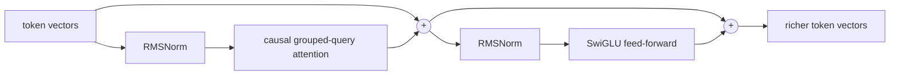
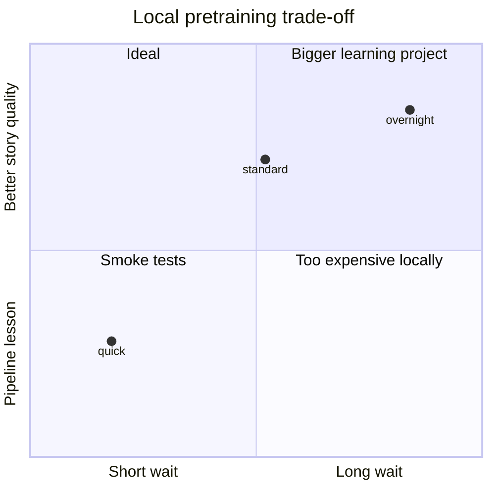

# The model, drawn before it is coded

## One training example is many predictions

```text
input   Once | upon | a | time
target  upon | a    | time | ,
          ↑      ↑      ↑    ↑
        four supervised next-token predictions in one pass
```

The causal mask prevents a token from reading the answer to its right:

```text
keys →       Once  upon  a  time
query Once     ●     ·   ·    ·
      upon     ●     ●   ·    ·
      a        ●     ●   ●    ·
      time     ●     ●   ●    ●

● visible    · hidden
```

## One transformer block



- **Attention is communication.** Each position chooses useful earlier positions.
- **Feed-forward is computation.** Each position transforms what it collected.
- **Residual `+` paths are memory highways.** New information is added without erasing the old representation.
- **RMSNorm controls scale.** It keeps deep updates numerically manageable.
- **RoPE gives order.** Query and key vectors rotate according to their positions.
- **Grouped-query attention shares keys and values.** It keeps most of multi-head attention's flexibility with less memory.

The full model repeats this block, normalizes once more, then uses the token embedding table backward as the next-token classifier. Sharing that table saves parameters.

## Why these three presets?

Model weights fit easily in 48 GB. Training time is the real constraint because every token touches nearly every parameter during forward and backward passes.



The `standard` preset is the practical center. Scaling much beyond it without far more high-quality data mostly buys waiting.
